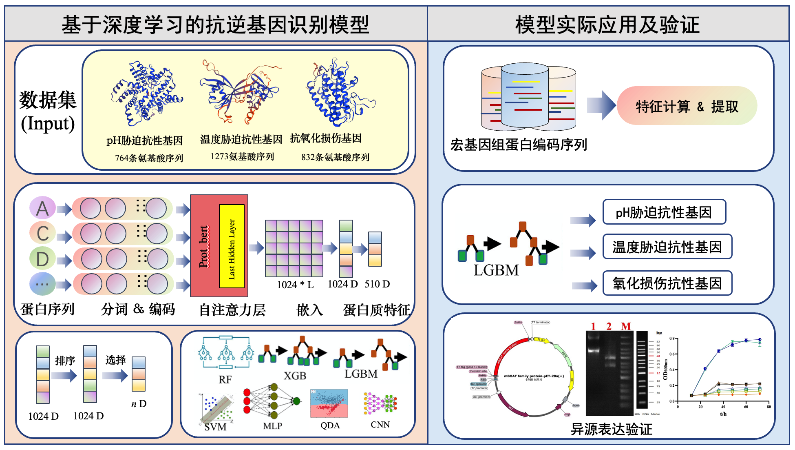

# DeepMSRB: 基于机器学习的微生物抗逆元件智能识别系统
### DeepMSRB: Intelligent recognition system for microbial stress resistance bioparts based on machine learning

Identification


## 📖 项目简介
DeepMSRB是基于预训练蛋白质语言模型Prot_bert特征提取，使用LGBM模型预测微生物抗逆元件的工具，创新性地解决了以下行业痛点：
- **传统方法依赖实验验证**：湿实验验证周期长（3-6个月/基因）
- **适用泛化性**：仅针对单一物种组学，元件多样性不足。
- **多平台兼容性差**：缺乏统一的分析工作流

技术亮点：

1. 🧠 基于蛋白质预训练大模型提取特征
2. ⚙️ 采用Snakemake构建标准化分析流程
3. 🎯通过GO功能定位，二次筛选候选结果

## 🛠️ 技术架构


核心技术组件：
| 模块                | 技术实现                     |
| ------------------- | ---------------------------- |
| 工作流管理          | Snakemake DAG引擎            |
| 深度学习（Prot_bert）预测 | Pytorch架构               |
| 机器学习（LGBM）预测 | Scikit-learn库              |
| GO注释              | DeepGOPlus(卷积神经网络注释) |
| 序列处理            | SeqKit高效处理               |
|                     |                              |
|                     |                              |


## 🚀 快速安装

### 前置要求
- Miniconda3 (Python ≥3.8)
- Linux/macOS系统
- 推荐配置：32GB内存 + NVIDIA GPU (CUDA 11.x)

### 环境部署
```bash
# 克隆仓库
git clone https://github.com/StressResistanceBioparts/DeepMSRB.git)

cd DeepMSRB

# 创建Conda环境
conda env create -f environment.yml

# 激活环境
conda activate DeepMSRB

# 安装核心脚本到系统路径
sudo cp src/work_script/* /usr/local/bin/

# 安装snakemake
pip install snakemake==7.22

# 将`core_softwares`目录添加到`PATH`环境变量中

nano ~/.bashrc
# 或者
nano ~/.zshrc
# 在文件的末尾，添加以下行，将core_softwares目录添加到PATH变量中：

export PATH="$PATH:/path/to/your/project/core_softwares"

#替换/path/to/your/project为你实际的路径。

source ~/.bashrc   # 如果是bash
source ~/.zshrc    # 如果是zsh


```

## 📈 使用指南

### 标准分析流程

```bash
# 进入环境
conda activate DeepMSRB_env

#使用流程
snakemake -s workflow -c {线程数} -p --use-conda 

```

## 📂 目录结构

```bash
DeepMSRB/
├── config/              # 配置文件
├── model/               # 模型存储
├── result/              # 输出结果
├── src/
│   ├── figure/          # 流程示意图
│   └── work_script/     # 核心执行脚本
└── environment.yml      # 依赖环境
```

